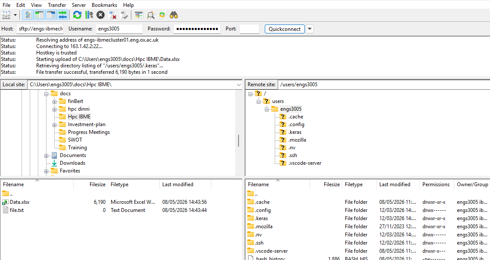

# 2. Transferring data to the Cluster

## Archiving file

The quickest way to transfer a large number of files is to archive the files into one file before transferring it over the network. This reduces the overhads of transferring individual files. In Linux and macOS *Tape Archive* knows as `tar` is used as combine multiple files and folder into a single file. The `tar` is often combined with compression tool such as `gzip`, which has `.gz` file extension. For example, to compress a directory *data* which have multiple subdirectories and files within the subdirectories in to a single file (compressed_data.tar.gz), the following command can be used:

!!! terminal "code"
    ```bash
    $ tar -cvzf compressed_data.tar.gz data
    ```

Windows systems also support `tar`, and the command above is compatible with Windows machines. For HPC systems, it is recommended to use `tar` instead of `zip` (which is available on Windows). The `tar` command preserves file and directory permissions, unlike `zip`. Since HPC systems typically run Linux distributions, working with a native archive format makes file handling easier.

Compare the reduction in size with the `du` command.

!!! terminal "code"
    ```bash
    $ du -sh data
    146M    data
    ```
    The output shows the data directory have a size of 146M

    ```bash
    $ du -sh compressed_data.tar.gz
    48M    data
    ```
    The compressed file have a size of 48M


## Transferring files


For Linux and macOS systems, the `rsync` command can be used to transfer files and directory to remote servers. For instance, to transfer the file *compressed_data.tar.gz* to a `user` home directory of the IBME CLuster, the following command can be used:

!!! terminal "code"
    ```bash
    $ rsync -avP compressed_data.tar.gz  <userid>@engs-ibmecluster01.eng.ox.ac.uk:~/
    ```

    - *compressed_data.tar.gz* is the file to be transferred

    - Remove the `<userid>` placeholder with username assigned for the HPC

    - *engs-ibmecluster01.eng.ox.ac.uk* is the host name of the IBME cluster

    - Anything after the `:` is the path where the file is going to be copied in the cluster 

After running the above command the, the IBME login nodes prompts the user for a password specific to the <userid>. upon entering the password and pressing the enter key, the file is successfully transferred to the destination. Similar command can also be used to transfer a directory and its content to the cluster. The files or directory can also be transferred to scratch storage (low latency fast storage) located in `/data/<userid>`.

For wondows user, it is recomended to install the [**Windows Subsystem for Linux (WSL)**](https://github.com/microsoft/WSL) to use `rsync`. After successfully installing WSL, the windows drives are automatecally mounted in `/mnt` directory located in root. Navigate to the directory containing the file to be transferred and use the command above to transfer the file or provide the exact path of the file in the command above.


!!! terminal "code"
    ```bash
    $ rsync -avP /mnt/Path_to_file/compressed_data.tar.gz  <userid>@engs-ibmecluster01.eng.ox.ac.uk:~/
    ```

  
## Transferring files with FileZilla

FileZilla is free file transfer software. It can be used to upload and download data from a remote server. To use the software, the [**FileZilla Client**](https://filezilla-project.org) can be downloaded and installed on a local computer. Once installed, FileZilla is available from the Windows Search pane and can be launched. The image below shows the graphical user interface of the software.

<p align="center">
    
</p>

The software has two file browser windows: one for the local computer on the left and one for the remote server on the right. Initially, the remote server file browser remains empty until a connection to the server is established.

To connect to the remote machine, in this case the IBME cluster. The follwing information should be provided:

- Host: *sftp://engs-ibmecluster01.eng.ox.ac.uk* (the host is *engs-ibmecluster01.eng.ox.ac.uk* and the *sftp* is the protocol)
- Username: `<userid>` (Username in the host machine)
- Password: The passowrd associated with the `<userid>`
- Post: This can be left black

After entering the connection details, click **Quickconnect**. If the connection is successful, the remote server file browser will appear on the right. Navigate to the required location by selecting folders in the file browser or by entering the directory path in the address bar. For the remote server entering the directory path directly is often more convenient.Files can then be transferred by dragging and dropping them between the left and right panels.
