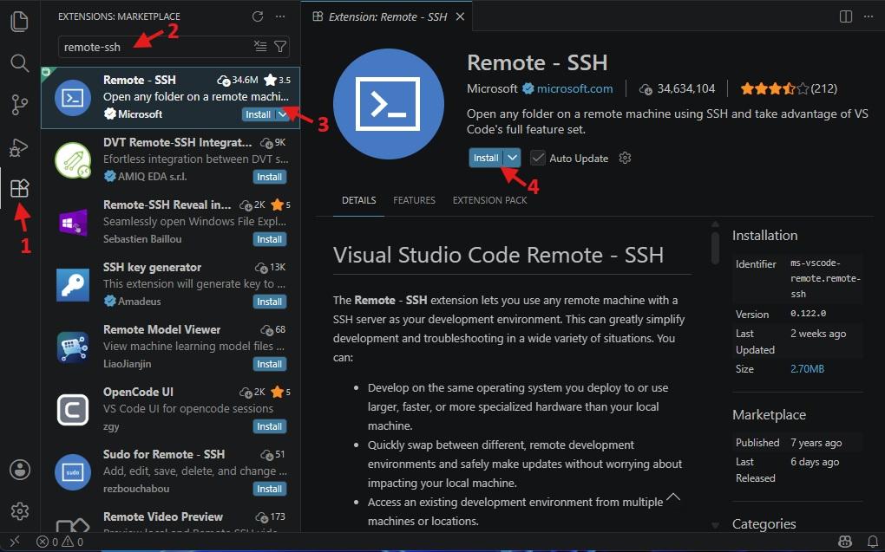
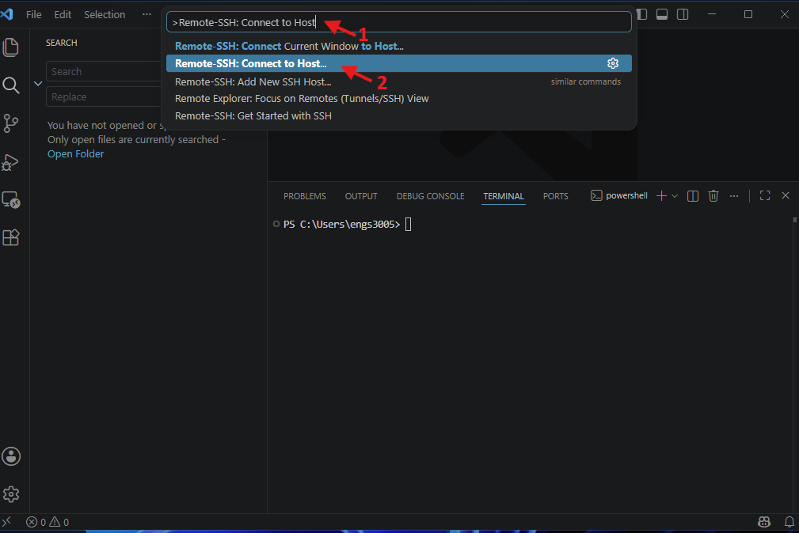
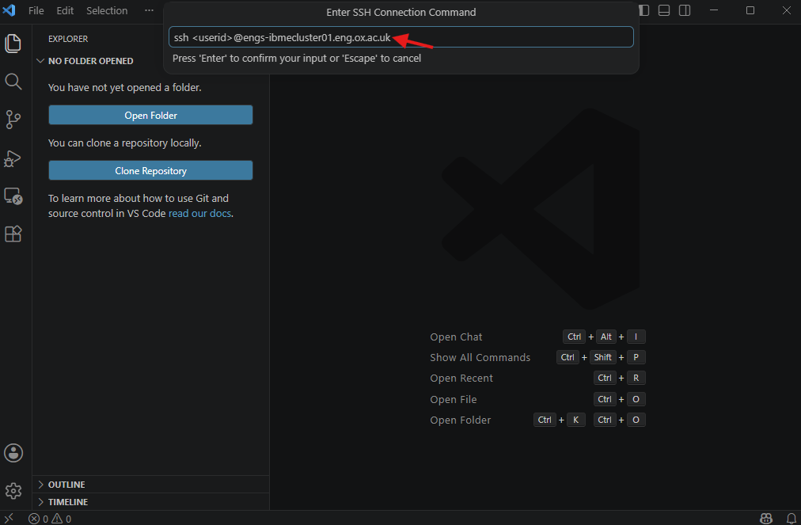
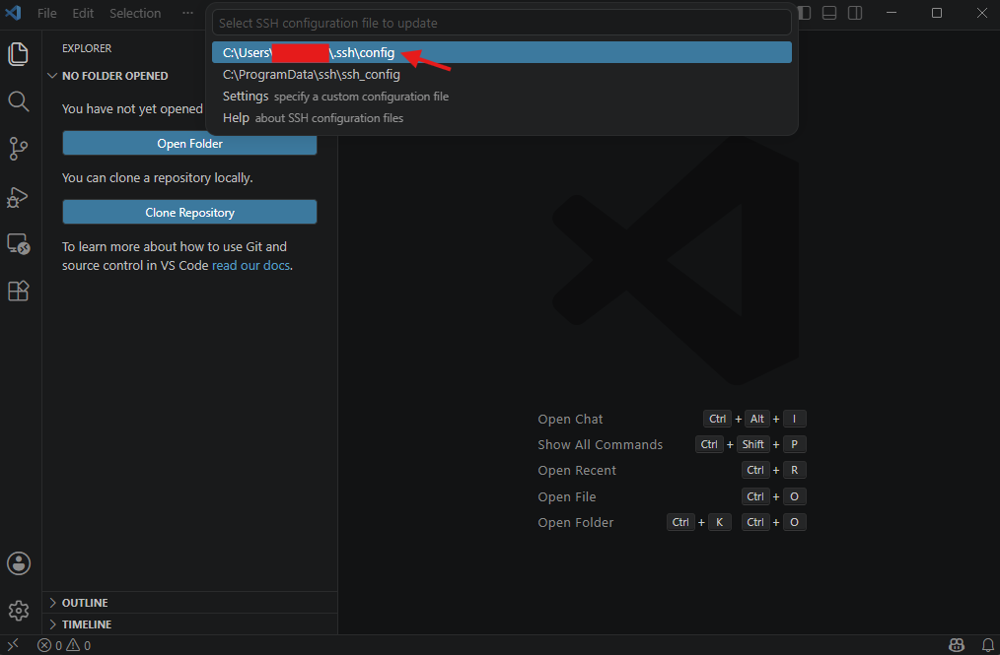
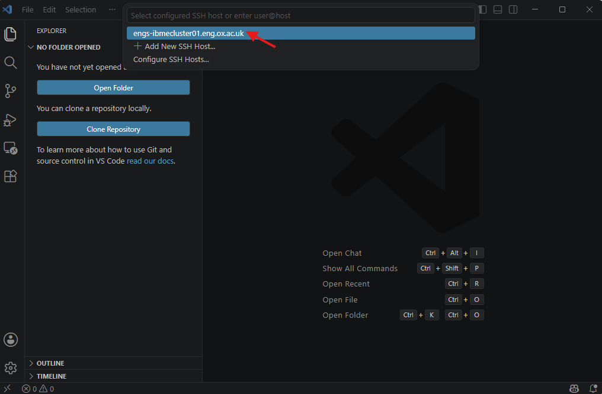
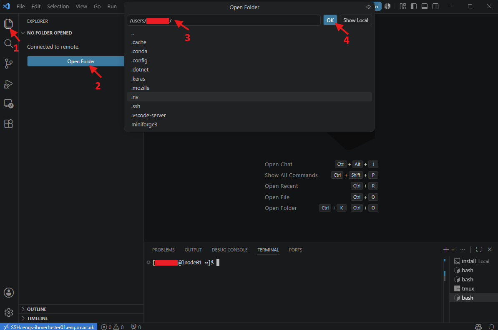
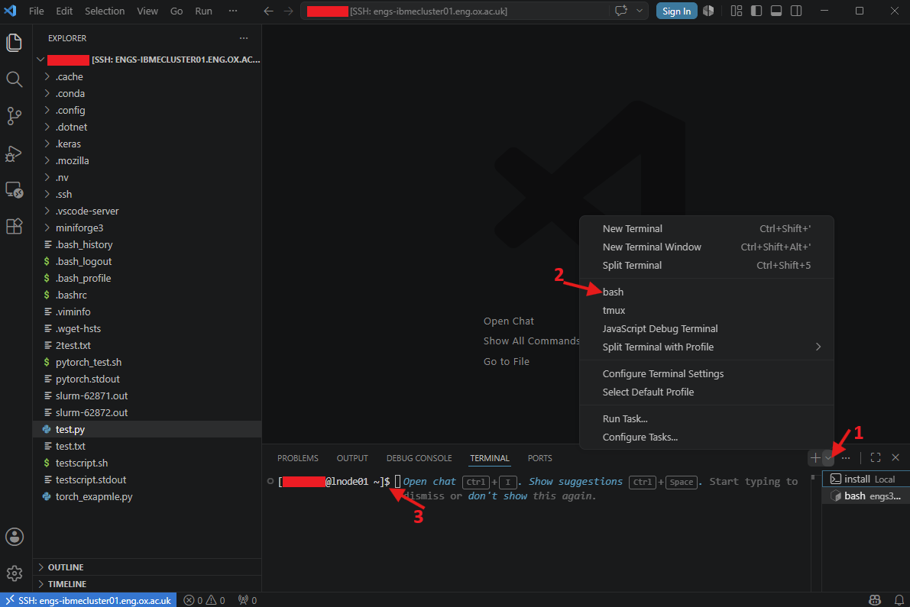

# 3. Editing files on the Cluster

The `vim` and `nano` commands are useful for making small edits and quick corrections to files on the HPC system. However, unlike modern code editors, they lack many advanced development features, including Git integration, debugging tools, integrated terminals, extensions, and syntax/error checking for multiple programming languages. As a result, they can be less convenient and more difficult to use when writing scripts or programs from scratch.

Visual Studio Code (VS Code) is a widely used code editor available for Linux, Windows, and macOS. It can connect directly to an HPC cluster, allowing users to edit and manage remote files as if they were stored on their local machine. The [**Installer**](https://code.visualstudio.com/Download) for each operating system can be downloaded from the official VS Code website. After downloading, double-click the installer to install VS Code on your computer.

See the steps below to connect VS Code to the IBME cluster:

- Depending on the installation, VS Code can be launched from the  icon on the desktop. If the desktop icon is not available, it can be opened using the Windows search bar. On macOS, VS Code can be launched from the Dock or Spotlight. On Linux, VS Code is available from the application menu.

- To ensure that files edited on the local computer are compatible with HPC systems, go to *File > Preferences > Settings*. This opens the Settings panel. In the left-side pane, select *Text Editor > Files*. This opens the Files section of the text editor. Scroll down to EOL and select *`\n`* from the dropdown menu. Close the Settings panel.

- Install Remote-SSH extension: Click on the *Extensions* icon in the sidebar to open the Marketplace. Enter *Remote-SSH* in the search bar and select the top result. The installation page will open on the right. Click *Install* to install the extension.

    

- Enable login terminal: Navigate to *File > Preferences > Settings* and search for *Remote.SSH: Show Login Terminal*. Ensure that the *Always reveal the SSH login terminal* option is checked. Restart VS Code.

- Type *Ctrl + Shift + P* to open the command palette, then type *Remote-SSH: Connect to Host* the text box and select it from the dropdown menu. Next, choose *Add New SSH Host…* to add a new SSH connection.

    

- Ensure your local computer is connected to either the IBME network or the University VPN.

- Enter the `ssh` connection command `ssh <userid>@engs-ibmecluster01.eng.ox.ac.uk` if you are on the IBME network or `ssh -L 7719:localhost:22 -J <userid>@ibme-ssh-gateway.eng.ox.ac.uk <userid>@engs-ibmecluster01.eng.ox.ac.uk` if you are connecting via VPN.
Note: Replace `<userid>` with your cluster username.

    

- Save the configuration file by selecting the first option in the dropdown menu. This saves the file directly into your home directory on Windows.

    

- Press *Ctrl + Shift + P* to open the command palette, then type *Remote-SSH: Connect to Host* in the text box and select it from the dropdown. If the configuration file was saved in the previous step, the remote host will appear in the next dropdown menu. Click on the remote host name to establish the connection.

    

- If prompted to select the platform type you are connecting to, choose *Linux*.

- A new VS Code window will open and attempt to connect to the IBME cluster. When prompted, enter the password associated with `<userid>`. Once authentication is successful, VS Code will be connected to the cluster.

- To open a directory on the cluster, click the *Explorer* icon in the sidebar and select *Open Folder*. Enter your desired directory path and click *OK*.

    

- The IBME cluster may prompt you to enter the password associated with your user account again. Once authentication is successful, the files and directories will appear in the Explorer pane. You can now edit and save them directly on the cluster through VS Code, with full support for your installed extensions.

- A bash terminal on the cluster can also be opened directly from VS Code.

    

- Log in to the head node using the command `ssh headnode1`. Once connected, Slurm commands and other IBME HPC utilities will be available directly within VS Code, allowing you to interact with the cluster.