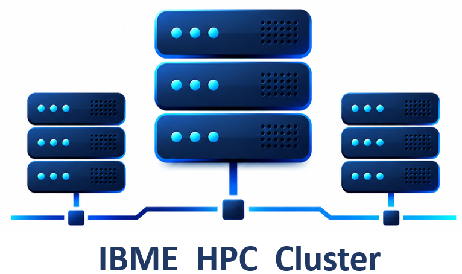

<!-- 

  

  

    <h1>Introduction to Linux Command Line</h1>
    
Institute of Biomedical Engineering, University of Oxford

  

 -->

    

| **Lesson**                                         | **Overview** | 
|:---------------------------------------------------|:-------------|
|1. [Introducing the shell](./1_background_introduction.md)| Introduce the shell |
|2. [Navigating and Managing files and directories](./2_navigating_files_and_dirs.md)| moving around the filesystem|
|3. [Creating, viewing, and editing files  ](./3_absolute_vs_relativepath.md)| Working with files from the shell|
|4. [Linux file system permission](./4_working_with_files_and_directories.md)| Control access to files and directories|
|5. [Transferring files to and from remote machine](./4_working_with_files_and_directories.md)| Copying files to and from HPC cluster |
|6. [Redirection](./5_redirection.md)|Employ the grep command to search for information within files|

!!! copyright "Attribution Notice"

    Materials used in these lessons are derived from : 

    * Data Carpentry ( 2023, May)._Introduction to the Command Line For Genomics_. https://datacarpentry.github.io/shell-genomics/